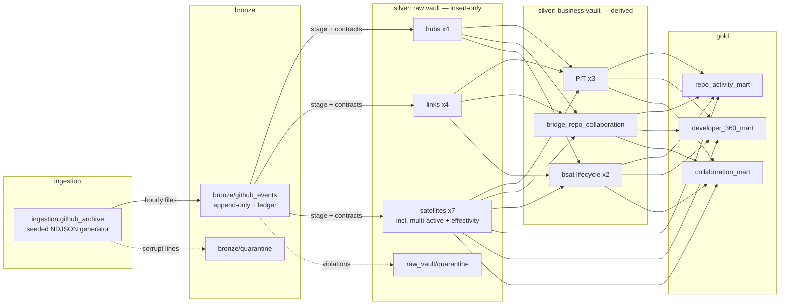

# Architecture

A local-first lakehouse over a synthetic GitHub events feed implementing
**Data Vault 2.0 inside a medallion architecture**, following the
conventions of the `data-engineering` template repo.

## Medallion ↔ Data Vault 2.0 mapping

| Medallion layer | Data Vault role | Physical home (local) | Unity Catalog |
|---|---|---|---|
| Bronze | Landing / persistent staging | `data/lakehouse/bronze/*` | `bronze.github`, `bronze.quarantine`, `bronze.ops` |
| Silver (1) | Raw vault — hubs, links, satellites; hard rules only | `data/lakehouse/raw_vault/*` | `silver.raw_vault` |
| Silver (2) | Business vault — PIT, bridge, computed satellites; soft rules | `data/lakehouse/business_vault/*` | `silver.business_vault` |
| Gold | Information marts | `data/lakehouse/gold/*` | `gold.marts` |

## Data flow

## Where each kind of rule lives

- **Extraction only** (JSON paths → columns): `pipelines/raw_vault/staging.py`
- **Hard rules** (nullability, enums): contracts, enforced in
  `pipelines/raw_vault/enforcement.py`, violations quarantined
- **Hashing**: `pipelines/common/hashing.py`, nowhere else (ADR 004)
- **Soft rules / business logic** (lifecycle milestones, effectivity
  resolution, cycle times, conformed naming): business vault and gold only
  (ADR 003)

## Idempotency model

| Layer | Mechanism |
|---|---|
| Bronze | file ledger: each landing file loads exactly once |
| Raw vault | insert-only MERGE over candidates recomputed from full bronze history; `--verify-idempotent` proves re-run ⇒ +0 rows |
| Business vault / gold | deterministic overwrite of derived tables |

## Run orchestration

Locally: `orchestration/demo.py` sequences subprocesses sharing one
`LAKEHOUSE_RUN_ID`; every step records to the `pipeline_run_metrics` Delta
table via `track_step`. Deployed: the Databricks Asset Bundle job declares
the same DAG with `depends_on` (ADR 005). DQ (`quality/expectations`) runs
last and fails the run on error-severity findings.

Read next: `docs/data_vault_catalog.md` (every object), `docs/marts/*.md`
(per-mart diagrams + lineage), `docs/adr/` (trade-offs), `docs/DECISIONS.md`
(assumption ledger).
