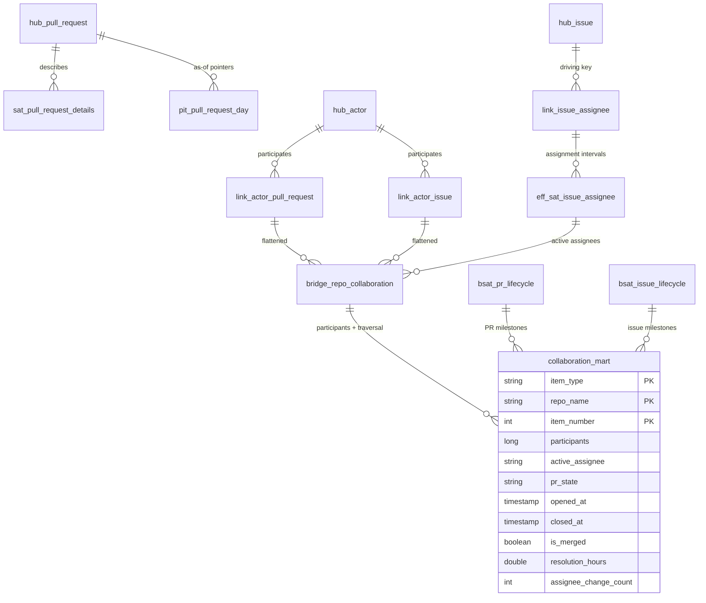

# collaboration_mart

**Grain**: one row per collaboration item — `(item_type, repo_name,
item_number)` where `item_type ∈ {pull_request, issue}`
**Consumers**: engineering managers (PR/issue flow, cycle time, assignment
health)
**SCD behavior**: current-state per item (type 1). The PR's current state
resolves through the *latest* `pit_pull_request_day` pointer; the active
assignee comes from the resolved effectivity satellite (closed intervals
supersede open ones). Full history remains queryable in the raw vault.

## Entity diagram



## Lineage

```
bronze/github_events
  -> raw_vault: hub_pull_request, hub_issue, hub_actor,
                link_actor_pull_request, link_actor_issue,
                link_issue_assignee (driving key: issue) + eff_sat_issue_assignee,
                sat_pull_request_details, sat_issue_details
  -> business_vault: bridge_repo_collaboration (3-link traversal),
                     bsat_pr_lifecycle, bsat_issue_lifecycle, pit_pull_request_day
  -> gold/collaboration_mart                  (pipelines/gold/collaboration.py)
```

This mart is the full DV2.0 pattern exercise: multi-link traversal via the
bridge, driving-key effectivity resolution, computed business satellites,
and PIT state resolution in one star.
