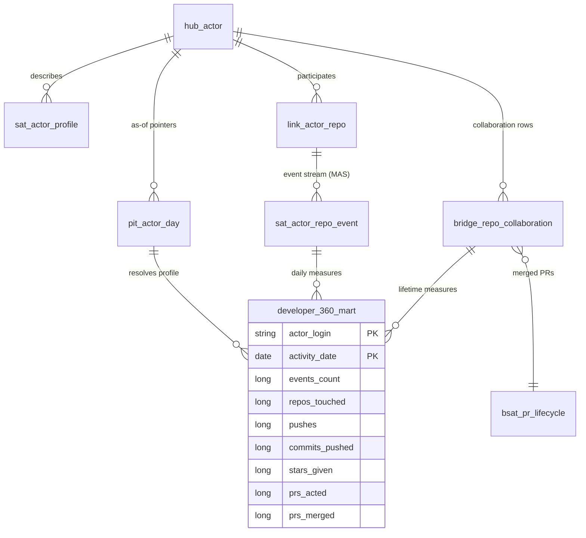

# developer_360_mart

**Grain**: one row per `(actor_login, activity_date)` (active days only)
**Consumers**: developer-experience / community teams (contributor 360 view)
**SCD behavior**: actor profile is as-of-day via `pit_actor_day` (type-2
served through PIT). Lifetime collaboration columns (`prs_acted`,
`issues_acted`, `prs_merged`) are current-state type-1 by design — they
answer "who is this contributor overall", not "what were they that day"
(documented deliberately; see pipelines/gold/README.md).

## Entity diagram



## Lineage

```
bronze/github_events
  -> raw_vault: hub_actor, link_actor_repo, sat_actor_repo_event, sat_actor_profile
  -> business_vault: pit_actor_day, bridge_repo_collaboration, bsat_pr_lifecycle
  -> gold/developer_360_mart                  (pipelines/gold/developer_360.py)
```
