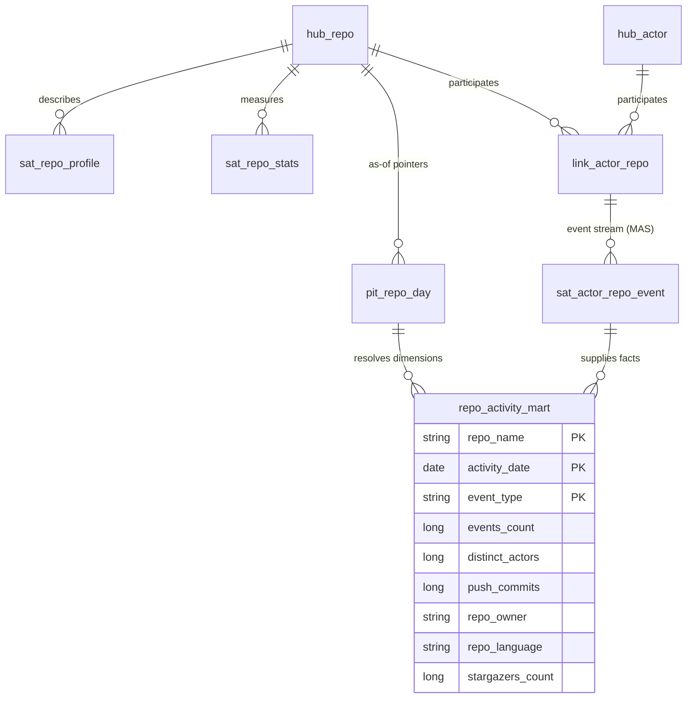

# repo_activity_mart

**Grain**: one row per `(repo_name, activity_date, event_type)`
**Consumers**: engineering-analytics dashboards (repo health, activity trends)
**SCD behavior**: repo dimension attributes are *as of the activity day*,
resolved through `pit_repo_day` pointers into the profile and stats
satellites (type-2 semantics served through PIT equi-joins; no window logic
in the mart).

## Entity diagram



## Lineage

```
landing NDJSON
  -> bronze/github_events                     (copy_into, ledger, quarantine)
  -> raw_vault: hub_repo, hub_actor, link_actor_repo,
                sat_actor_repo_event (facts), sat_repo_profile + sat_repo_stats (dims)
  -> business_vault: pit_repo_day             (end-of-day state pointers)
  -> gold/repo_activity_mart                  (pipelines/gold/repo_activity.py)
```

Facts aggregate the multi-active satellite (one row per event) grouped by
repo, day, and type; `push_commits` sums PushEvent sizes. Dimension columns
join through the PIT pointer for the row's own day — ghost-pointer days
surface as nulls, meaning "no repo detail observed yet".
